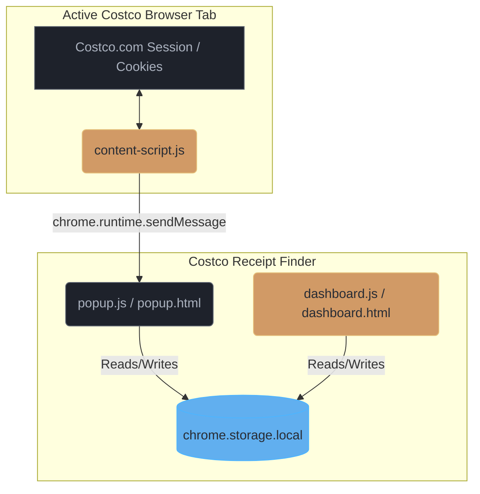

# 🧾 Costco Receipt Finder

A premium, privacy-first Chrome Extension and offline Web App Dashboard designed to extract, search, filter, analyze, and print your itemized Costco receipts (covering both in-warehouse purchases and online orders) securely without any remote server storage.

---

## 📖 Table of Contents
1. [Key Features](#-key-features)
2. [Technical & Security Architecture](#-technical--security-architecture)
3. [Installation Guide](#-installation-guide)
4. [Step-by-Step Sync Guide](#-step-by-step-sync-guide)
5. [Dashboard User Manual](#-dashboard-user-manual)
   - [Keyboard Shortcuts](#keyboard-shortcuts)
   - [Managing Nicknames (Aliases)](#managing-nicknames-aliases)
   - [Backup & Restore (JSON)](#backup--restore-json)
6. [Thermal Slip Printing Guide](#-thermal-slip-printing-guide)
7. [Troubleshooting & FAQ](#-troubleshooting--faq)

---

## ⚡ Key Features

* **🔒 100% Local & Private**: Your credentials, login cookies, and purchase history are kept entirely inside your browser's local sandbox (`chrome.storage.local`). Your financial data never leaves your computer.
* **⚡ GraphQL Scraper Bridge**: Scraping Costco data normally results in CORS or Akamai `403 Forbidden` errors. This extension safely scrapers-syncs receipts by executing queries directly inside your active Costco page context, inheriting your active authenticated session cookies.
* **🔍 Instant Fuzzy Search**: Instantly query your transaction history by item description, item number, date, custom nickname, or warehouse location.
* **📅 Custom Date Range Filters**: Filter receipt history to a custom date range using sidebar date pickers, with a dynamic active Date Range indicator displayed under your overview metrics.
* **🏬 Warehouse & Year Filters**: Dynamically aggregates your years and store locations to let you filter with one click.
* **💰 Spend Analytics**: View your total spend, average transaction amount, most visited warehouse, and a gorgeous dynamic SVG monthly spend chart covering the last 12 months.
* **🏷️ Global Nicknames (Aliases)**: Click on cryptic receipt line items (e.g. `KS ORG MILK`) to rename them with a friendly nickname (e.g. `My Organic Milk`) globally across all receipts.
* **🖨️ Thermal Receipt Printing**: Prints a narrow, unhighlighted, centered `80mm` thermal slip matching physical Costco receipts, with a sharp, scannable Code 39 barcode rendered on paper.
* **🔄 Backup & Restore (JSON)**: Export your entire synced receipt database and nicknames to a single backup JSON file and import it on another machine to prevent data loss.

---

## 🛠️ Technical & Security Architecture

Costco enforces strict Akamai bot-blocking security. Direct API connection from external Node servers or standalone scraper containers is blocked. This extension acts as a **Client-Side GraphQL Bridge**:

### Data Flow Logic
1. **Context Injection**: The `content-script.js` is injected into your active `costco.com` tab context.
2. **GraphQL Query**: It uses standard `window.fetch` to query Costco's internal order history GraphQL endpoint.
3. **Cookie Inheritance**: Because the request originates from the costco.com domain, the browser automatically attaches your active secure authentication cookies.
4. **Local Storage**: Data is parsed, sent to the extension storage, and the connection is closed.
5. **No Servers**: No remote databases or APIs are used. Your transactions are kept strictly inside your local browser.

---

## 🚀 Installation Guide

Follow these steps to load the unpacked extension in Google Chrome:

1. **Download/Clone the Extension**: Ensure all extension files are placed in a folder on your computer (e.g. `/Users/parthasarathi/Documents/Development/JavaScript/mycostco`).
2. **Open Chrome Extensions**: Open Google Chrome and navigate to `chrome://extensions/`.
3. **Enable Developer Mode**: Toggle the **Developer mode** switch in the top right corner to **ON**.
4. **Load the Extension**: Click **Load unpacked** in the top left corner, select your project folder, and click **Open**.
5. **Pin the Extension**: Click the puzzle piece icon on your Chrome toolbar and pin **Costco Receipt Finder** for quick access.

---

## 🔄 Step-by-Step Sync Guide

To fetch your itemized warehouse receipts, you must bridge Costco's authentication context:

1. Open a new browser tab and go to the Costco orders page: 
   👉 [costco.com/myaccount/#/app/ordersandpurchases](https://www.costco.com/myaccount/#/app/ordersandpurchases) (or log in and go to **Orders & Purchases** under My Account).
2. Log in with your normal Costco account credentials. (Complete any 2FA/OTP code requested by Costco).
3. Once looking at your Costco Orders and Purchases page, click the **Costco Receipt Finder** icon in your toolbar.
4. You will see a green status indicator: **Connected to Costco (Ready to synchronize receipts)**.
5. Click **Sync Receipts**.
6. The extension will retrieve your tokens dynamically, execute the fetch directly inside your Costco tab to inherit your login cookies, and automatically launch the **Web Dashboard** once sync is complete.

---

## 💻 Dashboard User Manual

The local Web Dashboard operates offline and can be accessed anytime by clicking **Open Web Dashboard** inside the extension toolbar popup.

### Keyboard Shortcuts

| Shortcut | Action | Scope |
| :--- | :--- | :--- |
| <kbd>Cmd</kbd> + <kbd>K</kbd> (Mac) / <kbd>Ctrl</kbd> + <kbd>K</kbd> (Windows) | Focuses and highlights the search input box immediately | Global Dashboard |
| <kbd>Escape (ESC)</kbd> | Closes the open receipt modal | Modal View |
| <kbd>Escape (ESC)</kbd> | Clears the active search query and resets the dashboard grid | Dashboard Search |

### Theme Customization
The dashboard supports three theme settings to match your visual preference:
* **Premium Dark**: The default modern dark interface optimized for low-light environments.
* **Solarized Light**: A beautiful, warm light mode utilizing classic Solarized base tones (`#fdf6e3` and `#eee8d5`) for high readability in daylight.
* **Sync with System**: Dynamically syncs the theme with your operating system's color scheme preference, switching between Premium Dark and Solarized Light automatically.

To change the theme, use the **Theme** selector dropdown at the bottom of the filters section in the sidebar.

### Managing Nicknames (Aliases)
Costco receipts often contain cryptic line items (e.g., `KS ORG CRBY`). You can rename them to make your search more intuitive:
1. Click any receipt card in the dashboard grid to open the detailed slip.
2. Hover over the item line you wish to rename.
3. Click on the item line. The **Alias Editor** will slide open in the sidebar.
4. Type your friendly nickname (e.g., `Organic Cranberry Juice`) and click **Save Nickname**.
5. The nickname is applied globally, appearing on all receipts and fully searchable!

### Backup & Restore (JSON)
To prevent data loss or migrate your data to another machine:
* **Export**: Click **Export** in the sidebar. A file named `costco-receipts-backup-YYYY-MM-DD.json` containing all your receipts, aliases, and sync metadata will download.
* **Import**: Click **Import** in the sidebar, select your backup JSON file, and confirm. Your data will merge, deduplicate, and reload automatically.

> [!NOTE]
> **Data Merging Safeguard**
> Receipts are merged and deduplicated using a compound unique key (`warehouseNumber-registerNumber-transactionNumber-transactionDate`). Your nicknames are merged safely; in case of conflict, imported nicknames override local ones.

---

## 🖨️ Thermal Slip Printing Guide

To get an authentic `80mm` physical receipt printout, configure your Chrome Print Settings as follows:

1. Open the receipt in the dashboard modal and click **Print Receipt** in the sidebar.
2. In the Chrome print dialogue window:
   * **Destination**: Select your Thermal Receipt Printer (e.g. Epson TM-T88) or select **Save as PDF**.
   * **Layout**: **Portrait**.
   * **Paper Size**: Choose `80mm x Roll` (or standard `80mm x 297mm`).
   * **Margins**: Set to **None** (or **Minimum** if your printer clips).
   * **Scale**: Set to **100%** or **Default**.
   * **Background graphics**: **MUST BE ENABLED** (this ensures the black barcode bars and tinted return indicators render correctly).
   * **Headers and Footers**: **MUST BE DISABLED** (removes browser URL and page numbers).

---

## ❓ Troubleshooting & FAQ

### 🚨 "Could not load icon 'icon.png' specified in 'icons'" error in Chrome
This occurs if the extension icons are not formatted as true PNGs. 
* **Fix**: This has been resolved in the latest version by ensuring all size variants (`icon16.png`, `icon32.png`, `icon48.png`, `icon128.png`) are compiled as true binary PNGs. Go to `chrome://extensions/` and click the **Reload** button on the extension card.

### 🔌 Sync button is disabled or says "Disconnected"
The extension content script requires an active, focused Costco purchases tab to bridge the connection.
* **Fix**: Ensure you have [costco.com/myaccount/#/app/ordersandpurchases](https://www.costco.com/myaccount/#/app/ordersandpurchases) open, that you are fully logged in, and that the tab is refreshed. Then click the extension popup again.

### 🛑 Akamai / "Access Denied" page appears on Costco
Costco uses strict bot-detection. If you sync too frequently or make rapid manual requests, you may trigger a temporary block.
* **Fix**: Close the popup, wait 1–2 minutes, navigate to the Costco tab, complete any CAPTCHA challenge presented on-screen, and then trigger the sync again.

### 🔒 Where is my data stored? Can Costco or third parties see it?
Your data is stored 100% locally in your browser's private directory via the `chrome.storage.local` API. The extension does not have any backend servers, does not use external analytics libraries, and never transmits your purchase history or credentials to any remote URL. Your privacy is fully guaranteed.

### 📊 Why does the monthly spending chart not display some months?
The monthly spending chart shows a rolling 12-month window starting from the current date. If you haven't made purchases in a specific month, that bar will display as `0` spend.
